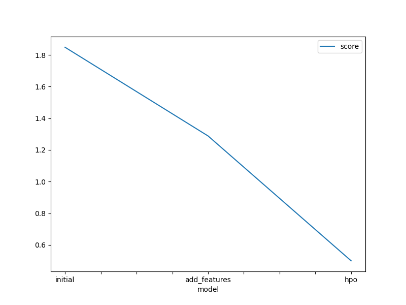
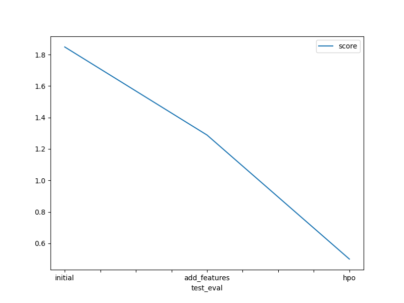

# Report: Predict Bike Sharing Demand with AutoGluon Solution

## Initial Training

### What did you realize when you tried to submit your predictions? What changes were needed to the output of the predictor to submit your results?

I had to check if there were any negative values and convert to 0s. The predictor had to be set to a dataframe and converted into a `csv` file in order to be submitted to kaggle.

### What was the top ranked model that performed?

The top rank model was the `WeightedEnsemble_L3` model.

## Exploratory data analysis and feature creation

### What did the exploratory analysis find and how did you add additional features?

Looking at the histograms of the features, it seemed unlikely that the `holiday` column would contribute any meaningful data since most of the dataset was not a holiday and only a few points were considered a holiday. I decided to drop this column. As an experiment, I decided to also drop the `workingday` column to see the results. I also split out the datetime values into separate `year`, `month`, `day`, and `hour` values, allowing the models to better identify any patterns and correlations with the `count` during a specific time of day.

### How much better did your model preform after adding additional features and why do you think that is?

It did a little better, with the score going down to `1.288` but there is still room for improvement. Separating the time improved the model and prediction of counts. Reducing the # of features by dropping the `workingday` and `holiday` columns also helped.

## Hyper parameter tuning

### How much better did your model preform after trying different hyper parameters?

I tried tweaking the hyperparameters twice, as the first time did not yield much difference or improvement over the baseline. On the second attempt, the model improved significantly, dropping to `0.49980`.

### If you were given more time with this dataset, where do you think you would spend more time?

If I had more time, I would spend more time in EDA phase and feature engineering to identify how the data can be improved to make better predictions.

### Create a table with the models you ran, the hyperparameters modified, and the kaggle score.

| gbm          | learning_rate | num_leaves | num_iterations | score   |
| ------------ | ------------- | ---------- | -------------- | ------- |
| initial      | default       | default    | default        | 1.84847 |
| add_features | default       | default    | default        | 1.28827 |
| hpo          | 0.15          | 50         | 150            | 0.49980 |

| xgb          | n_estimators | learning_rate | max_depth       | score   |
| ------------ | ------------ | ------------- | --------------- | ------- |
| initial      | default      | default       | default         | 1.84847 |
| add_features | default      | default       | default 1.28827 |
| hpo          | 125          | 0.15          | 150             | 0.49980 |

| nn           | num_epochs | learning_rate | dropout_prob | score   |
| ------------ | ---------- | ------------- | ------------ | ------- |
| initial      | default    | default       | default      | 1.84847 |
| add_features | default    | default       | default      | 1.28827 |
| hpo          | 14         | 0.1           | 0.1          | 0.49980 |

### Create a line plot showing the top model score for the three (or more) training runs during the project.

### Create a line plot showing the top kaggle score for the three (or more) prediction submissions during the project.

## Summary

The baseline results were not very good at making predictions. By exploring the data to understand how the data may be correlated and removing data that would not be very useful for training, the model improved. By allowing more time to be spent on specific models during the training phase using Autogluon and setting specific hyperparameters for models that could be tuned, the hyperparameter tuning resulted in an even better model that provided more accurate results. Tuning the models enabled the 3 models more training rounds in the specified time, allowing the model to predict results better.
